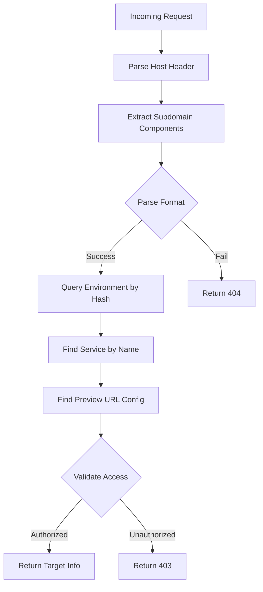

# Architecture: Preview URLs and Branch Environments

## Table of Contents
1. [Overview](#overview)
2. [Preview URLs Architecture](#preview-urls-architecture)
3. [Branch Environments Architecture](#branch-environments-architecture)
4. [Database Schema](#database-schema)
5. [Request Flow Diagrams](#request-flow-diagrams)
6. [Security and Access Control](#security-and-access-control)
7. [API Reference](#api-reference)
8. [Key Files Reference](#key-files-reference)
9. [Design Decisions](#design-decisions)

---

## Overview

Lapdev's Kubernetes integration supports two key features for development workflows:

1. **Preview URLs**: Publicly accessible URLs that expose specific services from Kubernetes environments
2. **Branch Environments**: Isolated development environments created from shared base environments

These features enable a GitOps-style workflow where developers can:
- Create isolated environments for feature branches
- Customize workloads without affecting shared environments
- Expose services via unique URLs with granular access control

---

## Preview URLs Architecture

### URL Format

Preview URLs follow this pattern:
```
https://{service-name}-{port}-{random-hash}.app.lap.dev
```

**Example:**
```
https://webapp-8080-abc123def456.app.lap.dev
```

**Components:**
- `service-name`: Kubernetes service name (e.g., "webapp")
- `port`: Service port number (e.g., "8080")
- `random-hash`: 12-character random identifier for uniqueness

### URL Generation

When creating a preview URL:

1. User selects a service and port from their environment
2. System generates subdomain: `{service.name}-{port}-{generate_random_12_chars()}`
3. Subdomain is globally unique (enforced by database constraint)
4. Full URL is returned to user

**Implementation:** `/workspaces/lapdev/crates/kube/src/preview_url.rs`

### URL Resolution Flow



**Resolution Steps:**

1. **Parse Subdomain**
   - Split on `-` delimiter
   - Extract: service name (all but last 2 parts), port (2nd to last), hash (last)

2. **Find Environment**
   - Query `kube_environment` table using environment hash
   - Currently uses `name` field (TODO: add dedicated hash field)

3. **Find Service**
   - Query `kube_environment_service` by `environment_id` and `service_name`

4. **Find Preview URL Configuration**
   - Query `kube_environment_preview_url` by `environment_id`, `service_id`, and `port`

5. **Validate Access Level**
   - Check user permissions based on access level (Personal/Shared/Public)

6. **Return Target**
   - Returns `PreviewUrlTarget` with cluster, namespace, service, port info

### HTTP Proxy Implementation

**File:** `/workspaces/lapdev/crates/kube/src/http_proxy.rs`

The `PreviewUrlProxy` is a standalone TCP-based proxy server:

**Architecture:**
- Listens on configured TCP port (e.g., 8080)
- Accepts incoming connections
- Parses HTTP request headers to extract `Host`
- Resolves preview URL to target service
- Opens tunnel to target via `TunnelRegistry`
- Performs bidirectional TCP streaming

**Key Features:**

1. **TCP-Level Proxying**
   - Does NOT parse full HTTP requests/responses
   - Forwards raw TCP streams bidirectionally
   - Supports WebSocket upgrades and streaming protocols

2. **Request Tracking**
   - Adds `tracestate` header: `lapdev-env-id={environment_id}`
   - Enables distributed tracing through proxy chain

3. **Connection Management**
   - Each connection gets unique tunnel ID
   - Automatic cleanup on connection close
   - Updates `last_accessed_at` timestamp for analytics

4. **Error Handling**
   - Returns HTTP error responses for resolution failures
   - Logs errors with tunnel ID for debugging

**Proxy Flow:**
```
Client → PreviewUrlProxy (TCP) → TunnelRegistry → kube-manager → K8s Service
         [Parse Host]            [Route to cluster]  [Forward]     [Handle]
```

### Access Control Levels

Defined in `/workspaces/lapdev/crates/common/src/kube.rs`:

| Level | Description | Authentication Required | Authorization Check |
|-------|-------------|------------------------|---------------------|
| **Personal** | Only accessible by owner | Yes | User must be owner |
| **Shared** | Accessible by org members | Yes | User must be in org |
| **Public** | Accessible by anyone | No | None |

Access validation happens in `PreviewUrlResolver::validate_access_level()` during URL resolution.

---

## Branch Environments Architecture

### Concept

Branch environments enable developers to:
- Create isolated environments from a shared "base" environment
- Customize workloads (images, env vars) without affecting the base
- Test changes independently before merging to shared environment

### Environment Types

| Type | `is_shared` | `base_environment_id` | Purpose |
|------|-------------|----------------------|---------|
| **Base/Shared** | `true` | `NULL` | Production or staging environment shared across org |
| **Personal** | `false` | `NULL` | Private environment owned by one user |
| **Branch** | `false` | UUID of base | Isolated dev environment forked from shared base |

**Rules:**
- Only **Shared** environments can be used as bases for branches
- Branch environments are always **Personal** (owned by creator)
- Cannot create a branch from another branch (no nested branching)

### Branch Environment Creation Flow

**Function:** `create_branch_environment()` in `/workspaces/lapdev/crates/api/src/kube_controller.rs`

**Steps:**

1. **Validation**
   ```
   - Verify base environment exists
   - Verify base belongs to same organization
   - Verify base.is_shared == true
   - Verify base.base_environment_id IS NULL
   - Verify cluster allows personal deployments
   ```

2. **Copy Configuration**
   ```
   - Retrieve all workloads from base environment
   - Retrieve all services from base environment
   - Convert to KubeWorkloadDetails and KubeServiceWithYaml
   ```

3. **Image Inheritance**
   ```
   For each container in workloads:
     - If base has custom image:
       → Set as original_image for branch
       → Set container image to FollowOriginal
     - Clear customized env vars
     - Preserve original_env_vars
   ```

4. **Create Database Records**
   ```
   Create kube_environment:
     - is_shared = false (always)
     - base_environment_id = <base env UUID>
     - namespace = <same as base>
     - app_catalog_id = <same as base>
     - cluster_id = <same as base>
     - name = <user-provided unique name>

   Copy all workloads and services with new environment_id
   ```

5. **No Immediate K8s Deployment**
   - Branch environments are NOT deployed to Kubernetes immediately
   - Only database records are created
   - Actual K8s resources created when workloads are first modified

### Branch vs Base Workload Deployment

When updating a workload in an environment:

**Base Environment** (`base_environment_id IS NULL`):
```
- RPC: update_workload_containers()
- Action: Update existing K8s deployment in-place
- Deployment name: {workload_name}
- Labels: lapdev.environment={env_name}
```

**Branch Environment** (`base_environment_id IS NOT NULL`):
```
- RPC: create_branch_workload()
- Action: Create NEW K8s deployment
- Deployment name: {workload_name}-branch-{env_id}
- Labels: lapdev.environment={branch_env_name}
- Selector: Unique to avoid conflicts with base
```

**File:** `/workspaces/lapdev/crates/api/src/kube_controller.rs:1644-1793`

### Namespace and Resource Isolation

Branch environments **share the same Kubernetes namespace** as their base environment but achieve isolation through:

1. **Unique Deployment Names**
   - Base: `deployment/webapp`
   - Branch: `deployment/webapp-branch-{uuid}`

2. **Unique Selectors**
   - Each branch deployment has unique labels
   - Services route only to their specific deployment

3. **Independent Lifecycle**
   - Deleting branch doesn't affect base
   - Deleting base doesn't auto-delete branches (orphan handling TBD)

**Example in namespace "staging":**
```yaml
# Base environment
apiVersion: apps/v1
kind: Deployment
metadata:
  name: webapp
  namespace: staging
  labels:
    lapdev.environment: staging

---

# Branch environment 1
apiVersion: apps/v1
kind: Deployment
metadata:
  name: webapp-branch-abc123
  namespace: staging
  labels:
    lapdev.environment: feature-x

---

# Branch environment 2
apiVersion: apps/v1
kind: Deployment
metadata:
  name: webapp-branch-def456
  namespace: staging
  labels:
    lapdev.environment: feature-y
```

---

## Database Schema

### `kube_environment`

Stores environment metadata.

**File:** `/workspaces/lapdev/crates/db/migration/src/m20250809_000001_create_kube_environment.rs`

| Column | Type | Constraints | Description |
|--------|------|-------------|-------------|
| `id` | UUID | PRIMARY KEY | Unique environment identifier |
| `organization_id` | UUID | NOT NULL, FK | Organization ownership |
| `user_id` | UUID | NOT NULL, FK | Creator/owner |
| `app_catalog_id` | UUID | NOT NULL, FK | Source app catalog template |
| `cluster_id` | UUID | NOT NULL, FK | Target Kubernetes cluster |
| `name` | String | NOT NULL | Display name |
| `namespace` | String | NOT NULL | Kubernetes namespace |
| `status` | String | NOT NULL | Running/Pending/Failed/etc |
| `is_shared` | Boolean | NOT NULL | Shared vs personal environment |
| `base_environment_id` | UUID | NULLABLE, FK → self | For branch environments |
| `created_at` | Timestamp | NOT NULL | Creation time |
| `deleted_at` | Timestamp | NULLABLE | Soft delete timestamp |

**Constraints:**
- Only one base environment per `(app_catalog_id, cluster_id, namespace)` where `base_environment_id IS NULL`

**Indexes:**
- `organization_id`
- `cluster_id`
- `base_environment_id`

### `kube_environment_preview_url`

Stores preview URL configurations.

**File:** `/workspaces/lapdev/crates/db/migration/src/m20250815_000001_create_kube_environment_preview_url.rs`

| Column | Type | Constraints | Description |
|--------|------|-------------|-------------|
| `id` | UUID | PRIMARY KEY | Unique preview URL identifier |
| `environment_id` | UUID | NOT NULL, FK | Parent environment |
| `service_id` | UUID | NOT NULL, FK | Target service |
| `name` | String | NOT NULL, UNIQUE | Subdomain identifier |
| `description` | Text | NULLABLE | User-provided description |
| `port` | i32 | NOT NULL | Target service port |
| `port_name` | String | NULLABLE | Named port reference |
| `protocol` | String | NOT NULL | "HTTP", "HTTPS", "WebSocket" |
| `access_level` | String | NOT NULL | "personal", "shared", "public" |
| `created_by` | UUID | NOT NULL, FK | User who created URL |
| `last_accessed_at` | Timestamp | NULLABLE | For analytics/cleanup |
| `metadata` | JSON | NULLABLE | Custom headers, rate limits, etc |
| `created_at` | Timestamp | NOT NULL | Creation time |
| `deleted_at` | Timestamp | NULLABLE | Soft delete timestamp |

**Constraints:**
- `name` UNIQUE (global subdomain uniqueness)
- `(service_id, port)` UNIQUE (one preview URL per service port)

**Indexes:**
- `environment_id`
- `service_id`
- `name` (for fast resolution)

### `kube_environment_workload`

Stores workload definitions (Deployments, StatefulSets, etc).

**File:** `/workspaces/lapdev/crates/db/migration/src/m20250809_000002_create_kube_environment_workload.rs`

| Column | Type | Description |
|--------|------|-------------|
| `id` | UUID | Unique workload identifier |
| `environment_id` | UUID | Parent environment |
| `name` | String | Workload name |
| `namespace` | String | Kubernetes namespace |
| `kind` | String | "Deployment", "StatefulSet", etc |
| `containers` | JSON | Array of `KubeContainerInfo` |
| `created_at` | Timestamp | Creation time |
| `deleted_at` | Timestamp | Soft delete |

**Container JSON Structure:**
```json
{
  "name": "webapp",
  "image": "Custom",
  "custom_image": "myregistry/webapp:v2.0",
  "original_image": "myregistry/webapp:v1.0",
  "resources": {...},
  "env_vars": {...},
  "original_env_vars": {...}
}
```

### `kube_environment_service`

Stores Kubernetes Service definitions.

**File:** `/workspaces/lapdev/crates/db/migration/src/m20250809_000003_create_kube_environment_service.rs`

| Column | Type | Description |
|--------|------|-------------|
| `id` | UUID | Unique service identifier |
| `environment_id` | UUID | Parent environment |
| `name` | String | Service name |
| `namespace` | String | Kubernetes namespace |
| `yaml` | Text | Full YAML definition |
| `ports` | JSON | Array of service ports |
| `selector` | JSON | Pod selector labels |
| `created_at` | Timestamp | Creation time |
| `deleted_at` | Timestamp | Soft delete |

---

## Request Flow Diagrams

### Preview URL Access Flow

```
┌─────────────────────────────────────────────────────────────────────┐
│ 1. User Request                                                     │
│    GET https://webapp-8080-abc123.app.lap.dev/api/users            │
└────────────────────────────────┬────────────────────────────────────┘
                                 │
                                 ▼
┌─────────────────────────────────────────────────────────────────────┐
│ 2. PreviewUrlProxy (TCP Server)                                     │
│    - Accept TCP connection                                          │
│    - Parse HTTP headers                                             │
│    - Extract Host: webapp-8080-abc123.app.lap.dev                  │
└────────────────────────────────┬────────────────────────────────────┘
                                 │
                                 ▼
┌─────────────────────────────────────────────────────────────────────┐
│ 3. PreviewUrlResolver                                               │
│    - Parse subdomain: service="webapp", port=8080, hash="abc123"   │
│    - Query kube_environment WHERE name LIKE '%abc123%'             │
│    - Query kube_environment_service WHERE name='webapp'            │
│    - Query kube_environment_preview_url WHERE port=8080            │
│    - Validate access level                                          │
│    - Return PreviewUrlTarget                                        │
└────────────────────────────────┬────────────────────────────────────┘
                                 │
                                 ▼
┌─────────────────────────────────────────────────────────────────────┐
│ 4. Add Tracestate Header                                            │
│    tracestate: lapdev-env-id={environment_id}                       │
└────────────────────────────────┬────────────────────────────────────┘
                                 │
                                 ▼
┌─────────────────────────────────────────────────────────────────────┐
│ 5. TunnelRegistry                                                   │
│    - Find tunnel to target cluster                                  │
│    - Send tunnel message with target service info                   │
│    - Open bidirectional TCP stream                                  │
└────────────────────────────────┬────────────────────────────────────┘
                                 │
                                 ▼
┌─────────────────────────────────────────────────────────────────────┐
│ 6. kube-manager (in cluster)                                        │
│    - Receive tunnel request                                         │
│    - Connect to K8s service: webapp.staging.svc.cluster.local:8080 │
│    - Forward HTTP request                                           │
└────────────────────────────────┬────────────────────────────────────┘
                                 │
                                 ▼
┌─────────────────────────────────────────────────────────────────────┐
│ 7. Kubernetes Service → Pod                                         │
│    - Route to healthy pod                                           │
│    - Application processes request                                  │
│    - Return response                                                │
└────────────────────────────────┬────────────────────────────────────┘
                                 │
                                 ▼
┌─────────────────────────────────────────────────────────────────────┐
│ 8. Response Stream                                                  │
│    Pod → kube-manager → Tunnel → PreviewUrlProxy → Client          │
└─────────────────────────────────────────────────────────────────────┘
```

### Branch Environment Creation Flow

```
┌─────────────────────────────────────────────────────────────────────┐
│ 1. Shared Environment "staging" exists                              │
│    - is_shared = true                                               │
│    - base_environment_id = NULL                                     │
│    - Deployed to K8s namespace "staging"                            │
│    - Workloads: webapp (Deployment), db (StatefulSet)              │
│    - Services: webapp-svc, db-svc                                   │
└────────────────────────────────┬────────────────────────────────────┘
                                 │
                                 ▼
┌─────────────────────────────────────────────────────────────────────┐
│ 2. Developer Creates Branch "feature-login"                         │
│    POST /api/kube/environment/branch                                │
│    {                                                                │
│      "base_environment_id": "staging-uuid",                         │
│      "name": "feature-login"                                        │
│    }                                                                │
└────────────────────────────────┬────────────────────────────────────┘
                                 │
                                 ▼
┌─────────────────────────────────────────────────────────────────────┐
│ 3. Validation                                                       │
│    ✓ Base environment exists                                        │
│    ✓ Base is shared (is_shared=true)                               │
│    ✓ Base is not itself a branch (base_environment_id=NULL)        │
│    ✓ User belongs to same organization                             │
│    ✓ Cluster allows personal deployments                           │
└────────────────────────────────┬────────────────────────────────────┘
                                 │
                                 ▼
┌─────────────────────────────────────────────────────────────────────┐
│ 4. Copy Configuration to Database                                   │
│                                                                     │
│    Create kube_environment:                                         │
│      - id = new-uuid                                                │
│      - name = "feature-login"                                       │
│      - base_environment_id = "staging-uuid"                         │
│      - is_shared = false                                            │
│      - namespace = "staging" (same as base)                         │
│                                                                     │
│    Copy workloads:                                                  │
│      - webapp: original_image = base.custom_image                   │
│                image = FollowOriginal                               │
│      - db: original_image = base.custom_image                       │
│             image = FollowOriginal                                  │
│                                                                     │
│    Copy services:                                                   │
│      - webapp-svc (full YAML)                                       │
│      - db-svc (full YAML)                                           │
└────────────────────────────────┬────────────────────────────────────┘
                                 │
                                 ▼
┌─────────────────────────────────────────────────────────────────────┐
│ 5. NO Kubernetes Deployment Yet                                     │
│    - Branch environment exists only in database                     │
│    - No K8s resources created                                       │
│    - Waiting for first workload update                              │
└────────────────────────────────┬────────────────────────────────────┘
                                 │
                                 ▼
┌─────────────────────────────────────────────────────────────────────┐
│ 6. Developer Updates Workload                                       │
│    PATCH /api/kube/environment/{id}/workload/{workload_id}         │
│    {                                                                │
│      "containers": [{                                               │
│        "name": "webapp",                                            │
│        "image": "Custom",                                           │
│        "custom_image": "myregistry/webapp:feature-login"           │
│      }]                                                             │
│    }                                                                │
└────────────────────────────────┬────────────────────────────────────┘
                                 │
                                 ▼
┌─────────────────────────────────────────────────────────────────────┐
│ 7. Deploy Branch Workload to Kubernetes                             │
│                                                                     │
│    RPC: create_branch_workload()                                    │
│                                                                     │
│    Create in namespace "staging":                                   │
│      apiVersion: apps/v1                                            │
│      kind: Deployment                                               │
│      metadata:                                                      │
│        name: webapp-branch-{new-uuid}                               │
│        namespace: staging                                           │
│        labels:                                                      │
│          lapdev.environment: feature-login                          │
│      spec:                                                          │
│        selector:                                                    │
│          matchLabels:                                               │
│            lapdev.workload: webapp-branch-{new-uuid}                │
│        template:                                                    │
│          spec:                                                      │
│            containers:                                              │
│            - name: webapp                                           │
│              image: myregistry/webapp:feature-login                 │
└────────────────────────────────┬────────────────────────────────────┘
                                 │
                                 ▼
┌─────────────────────────────────────────────────────────────────────┐
│ 8. Create Preview URL                                               │
│    POST /api/kube/environment/{id}/preview-url                     │
│    {                                                                │
│      "service_id": "webapp-svc-uuid",                               │
│      "port": 8080,                                                  │
│      "access_level": "Personal"                                     │
│    }                                                                │
│                                                                     │
│    → Generated URL: https://webapp-8080-xyz789.app.lap.dev         │
└────────────────────────────────┬────────────────────────────────────┘
                                 │
                                 ▼
┌─────────────────────────────────────────────────────────────────────┐
│ 9. Developer Tests Changes                                          │
│    - Access via preview URL                                         │
│    - Changes isolated from "staging" base                           │
│    - Can iterate without affecting team                             │
└─────────────────────────────────────────────────────────────────────┘
```

---

## Security and Access Control

### Organization-Level Security

All environments belong to an organization:
- User must be authenticated
- User must be member of the organization
- Verified by `organization_user` table join

**Implementation:** All API endpoints check organization membership.

### Environment-Level Access

| Environment Type | Who Can Access | Check Method |
|------------------|----------------|--------------|
| Shared | Any org member | Check `is_shared=true` + org membership |
| Personal | Owner only | Check `user_id = requesting_user` |
| Branch | Creator only | Check `user_id = requesting_user` (always personal) |

**Implementation:** `/workspaces/lapdev/crates/api/src/kube_controller.rs`

### Preview URL Access Control

Three-tier access model:

**1. Personal**
- Requires authentication
- User must be the environment owner (`environment.user_id = user.id`)
- Most restrictive

**2. Shared**
- Requires authentication
- User must be in the same organization (`environment.organization_id = user.organization_id`)
- Medium security

**3. Public**
- No authentication required
- Anyone can access
- Least restrictive (use with caution)

**Access Validation Flow:**
```rust
fn validate_access_level(
    preview_url: &PreviewUrl,
    environment: &Environment,
    user: Option<&User>
) -> Result<()> {
    match preview_url.access_level {
        AccessLevel::Public => Ok(()),
        AccessLevel::Shared => {
            let user = user.ok_or(Unauthorized)?;
            if user.organization_id == environment.organization_id {
                Ok(())
            } else {
                Err(Forbidden)
            }
        }
        AccessLevel::Personal => {
            let user = user.ok_or(Unauthorized)?;
            if user.id == environment.user_id {
                Ok(())
            } else {
                Err(Forbidden)
            }
        }
    }
}
```

**Implementation:** `/workspaces/lapdev/crates/kube/src/preview_url.rs`

### Security Considerations

**Risks:**
- Public preview URLs expose services without authentication
- Branch environments in shared namespace could access base environment's secrets
- Subdomain enumeration could reveal organization structure

**Mitigations:**
- Access level defaults to "Personal" (most restrictive)
- Network policies should isolate branch deployments
- Rate limiting on preview URL creation (TODO: implement)
- Audit logging for all preview URL access (via `last_accessed_at`)

---

## API Reference

### Environment Operations

**List Environments**
```
GET /api/kube/environments
Query Params:
  - type: "personal" | "shared" | "branch"

Response: Array<{
  id: UUID,
  name: String,
  namespace: String,
  cluster_id: UUID,
  is_shared: Boolean,
  base_environment_id?: UUID,
  status: String
}>
```

**Get Environment Details**
```
GET /api/kube/environment/{id}

Response: {
  id: UUID,
  name: String,
  namespace: String,
  cluster_id: UUID,
  is_shared: Boolean,
  base_environment_id?: UUID,
  workloads: Array<Workload>,
  services: Array<Service>,
  preview_urls: Array<PreviewUrl>
}
```

**Create Base/Personal Environment**
```
POST /api/kube/environment

Body: {
  name: String,
  app_catalog_id: UUID,
  cluster_id: UUID,
  namespace: String,
  is_shared: Boolean
}

Response: {
  id: UUID,
  ...
}
```

**Create Branch Environment**
```
POST /api/kube/environment/branch

Body: {
  base_environment_id: UUID,
  name: String
}

Response: {
  id: UUID,
  base_environment_id: UUID,
  ...
}
```

**Delete Environment**
```
DELETE /api/kube/environment/{id}

Response: 204 No Content
```

### Preview URL Operations

**List Preview URLs for Environment**
```
GET /api/kube/environment/{id}/preview-urls

Response: Array<{
  id: UUID,
  name: String,
  url: String,
  service_id: UUID,
  port: Integer,
  access_level: "personal" | "shared" | "public",
  description?: String
}>
```

**Create Preview URL**
```
POST /api/kube/environment/{id}/preview-url

Body: {
  service_id: UUID,
  port: Integer,
  access_level: "personal" | "shared" | "public",
  description?: String
}

Response: {
  id: UUID,
  name: String,
  url: String,
  ...
}
```

**Update Preview URL**
```
PATCH /api/kube/environment/{env_id}/preview-url/{url_id}

Body: {
  description?: String,
  access_level?: "personal" | "shared" | "public"
}

Response: {
  id: UUID,
  ...
}
```

**Delete Preview URL**
```
DELETE /api/kube/environment/{env_id}/preview-url/{url_id}

Response: 204 No Content
```

### Workload Operations

**List Environment Workloads**
```
GET /api/kube/environment/{id}/workloads

Response: Array<{
  id: UUID,
  name: String,
  kind: String,
  containers: Array<Container>
}>
```

**Update Workload**
```
PATCH /api/kube/environment/{id}/workload/{workload_id}

Body: {
  containers: Array<{
    name: String,
    image: "FollowOriginal" | "Custom",
    custom_image?: String,
    env_vars?: Object
  }>
}

Response: 200 OK
```

---

## Key Files Reference

### Backend Core

| File | Purpose |
|------|---------|
| `/workspaces/lapdev/crates/kube/src/preview_url.rs` | Preview URL parsing, resolution, and validation |
| `/workspaces/lapdev/crates/kube/src/http_proxy.rs` | TCP-based HTTP proxy for preview URLs |
| `/workspaces/lapdev/crates/api/src/kube_controller.rs` | Business logic for environments, workloads, preview URLs |
| `/workspaces/lapdev/crates/db/src/api.rs` | Database CRUD operations |

### Database Migrations

| File | Purpose |
|------|---------|
| `/workspaces/lapdev/crates/db/migration/src/m20250809_000001_create_kube_environment.rs` | Environment table |
| `/workspaces/lapdev/crates/db/migration/src/m20250809_000002_create_kube_environment_workload.rs` | Workload table |
| `/workspaces/lapdev/crates/db/migration/src/m20250809_000003_create_kube_environment_service.rs` | Service table |
| `/workspaces/lapdev/crates/db/migration/src/m20250815_000001_create_kube_environment_preview_url.rs` | Preview URL table |

### Database Entities

| File | Purpose |
|------|---------|
| `/workspaces/lapdev/crates/db/entities/src/kube_environment.rs` | Environment entity model |
| `/workspaces/lapdev/crates/db/entities/src/kube_environment_workload.rs` | Workload entity model |
| `/workspaces/lapdev/crates/db/entities/src/kube_environment_service.rs` | Service entity model |
| `/workspaces/lapdev/crates/db/entities/src/kube_environment_preview_url.rs` | Preview URL entity model |

### Frontend Components

| File | Purpose |
|------|---------|
| `/workspaces/lapdev/crates/dashboard/src/kube_environment.rs` | Environment list view (Personal/Shared/Branch tabs) |
| `/workspaces/lapdev/crates/dashboard/src/kube_environment_detail.rs` | Environment detail page with workloads/services/preview URLs |
| `/workspaces/lapdev/crates/dashboard/src/kube_environment_preview_url.rs` | Preview URL management UI |

### Common Types

| File | Purpose |
|------|---------|
| `/workspaces/lapdev/crates/common/src/kube.rs` | Shared data structures (AccessLevel, KubeWorkloadDetails, etc) |

---

## Design Decisions

### 1. Branch Environments Share Namespace with Base

**Decision:** Branch environments deploy to the same Kubernetes namespace as their base environment, using different deployment names for isolation.

**Rationale:**
- Simplifies network policies (services can communicate within namespace)
- Reduces cluster resource consumption (fewer namespaces to manage)
- Allows sharing of ConfigMaps and Secrets from base

**Trade-offs:**
- Potential resource conflicts (PVCs, Services with same name)
- Less strict isolation (network policies apply at namespace level)
- Requires careful naming to avoid collisions

**Alternative Considered:** Create separate namespace per branch
- Rejected due to namespace proliferation and management overhead

### 2. Lazy Deployment of Branch Environments

**Decision:** Branch environments are created in the database immediately but K8s resources are not deployed until workloads are first modified.

**Rationale:**
- Saves cluster resources for unused branches
- Faster branch creation (no K8s API calls)
- Allows review of configuration before deployment

**Trade-offs:**
- Inconsistent state (database exists but K8s doesn't)
- Potential confusion for users (environment shows "Pending" until deployed)

**Alternative Considered:** Deploy immediately
- Rejected due to resource waste for short-lived test branches

### 3. TCP-Level HTTP Proxying

**Decision:** The preview URL proxy operates at the TCP level, not HTTP request/response parsing.

**Rationale:**
- Supports WebSocket upgrades seamlessly
- Supports HTTP/2 and streaming protocols
- Lower latency (no request buffering)
- Simpler implementation (no HTTP parser needed)

**Trade-offs:**
- Cannot modify response bodies
- Cannot implement request-level rate limiting
- Cannot add custom headers to responses (only requests)

**Alternative Considered:** Full HTTP proxy with request/response parsing
- Rejected due to complexity and WebSocket support requirements

### 4. Subdomain-Based Preview URLs

**Decision:** Preview URLs use subdomains with embedded metadata: `{service}-{port}-{hash}.app.lap.dev`

**Rationale:**
- Stateless resolution (no database lookup for routing)
- Globally unique (enforced by DNS)
- Human-readable (service and port visible)
- SEO-friendly (each URL is distinct)

**Trade-offs:**
- Exposes service names in URL
- Hash is not cryptographically secure (12 random chars)
- Cannot change URL after creation (name is immutable)

**Alternative Considered:** Path-based routing (`app.lap.dev/{hash}/...`)
- Rejected due to path prefix conflicts and less clean URLs

### 5. Image Inheritance from Base to Branch

**Decision:** When creating a branch, if the base has custom images, they are set as `original_image` in the branch and the container image is set to `FollowOriginal`.

**Rationale:**
- Allows developers to see what the base is running
- Provides clear diff between base and branch
- Enables easy revert to base configuration

**Trade-offs:**
- Requires two-step update (first to `FollowOriginal`, then to `Custom`)
- More complex data model (`original_image` vs `custom_image`)

**Alternative Considered:** Copy custom images as-is
- Rejected because branches would immediately diverge from base without visibility

### 6. Three-Tier Access Control

**Decision:** Preview URLs support three access levels: Personal, Shared, Public.

**Rationale:**
- Personal: Safe default for private development
- Shared: Enables team collaboration without exposing to internet
- Public: Necessary for stakeholder/client demos

**Trade-offs:**
- "Public" is dangerous if misused (exposed to internet)
- No fine-grained permissions (e.g., specific user allowlist)

**Alternative Considered:** Binary public/private
- Rejected because team collaboration is a core use case

### 7. Soft Deletes Throughout

**Decision:** All tables use `deleted_at` timestamp instead of hard deletes.

**Rationale:**
- Enables audit trail
- Allows undoing accidental deletions
- Historical analytics (e.g., preview URL access trends)

**Trade-offs:**
- Unique constraints must account for soft-deleted records
- Database grows over time (requires cleanup jobs)
- More complex queries (always filter `deleted_at IS NULL`)

**Alternative Considered:** Hard deletes with archive tables
- Rejected due to complexity of maintaining separate archive schema

### 8. No Nested Branching

**Decision:** Branch environments can only be created from shared environments, not from other branches.

**Rationale:**
- Simplifies mental model (two-level hierarchy: base → branches)
- Prevents complex dependency chains
- Reduces risk of orphaned environments

**Trade-offs:**
- Cannot create sub-branches for experimental features
- Developers must merge to base before creating new branch

**Alternative Considered:** Allow nested branching
- Rejected due to UX complexity and unclear use case

---

## Future Enhancements

### Planned
- [ ] Dedicated `environment_hash` field (not reusing `name`)
- [ ] Rate limiting for preview URL creation
- [ ] Preview URL analytics dashboard
- [ ] Network policies for branch environment isolation
- [ ] Automatic cleanup of stale branch environments
- [ ] Branch environment templates (pre-configured workload overrides)

### Under Consideration
- [ ] Custom domain support for preview URLs
- [ ] Fine-grained access control (user/team allowlists)
- [ ] Preview URL expiration dates
- [ ] Branch environment diffing (show changes from base)
- [ ] Automatic branch environment creation from git hooks

---

## Glossary

| Term | Definition |
|------|------------|
| **Base Environment** | A shared environment that can be used as the source for branch environments |
| **Branch Environment** | A personal environment forked from a shared base environment |
| **Preview URL** | A publicly accessible URL that routes to a service in an environment |
| **Access Level** | Security tier for preview URLs: Personal, Shared, or Public |
| **Environment** | A collection of Kubernetes workloads and services deployed to a cluster |
| **Workload** | A Kubernetes resource that runs containers (Deployment, StatefulSet, etc) |
| **Service** | A Kubernetes Service that exposes workload pods |
| **App Catalog** | A template defining workloads and services that can be deployed |
| **Tunnel** | A persistent TCP connection between lapdev-api and kube-manager for proxying |

---

**Document Version:** 1.0
**Last Updated:** 2025-10-01
**Maintainers:** Lapdev Core Team
