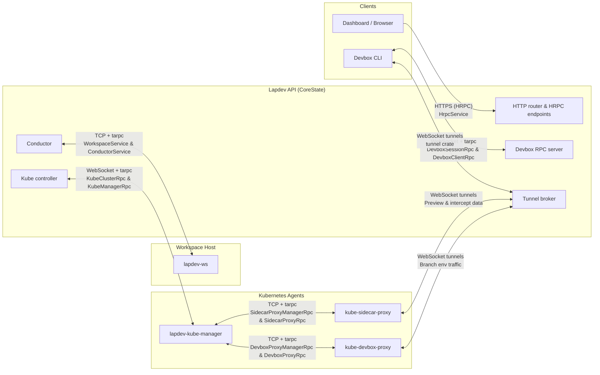

# Lapdev RPC Architecture

Lapdev combines tarpc-based transports with HTTP RPC (HRPC) endpoints to coordinate the control plane, workspace hosts, developers' CLIs, and Kubernetes agents. The diagram below highlights the main RPC links and which component resides on each side of the connection.

## RPC Topology

## Link details

| Source → Target | Transport | RPC traits / channel | Purpose |
| --- | --- | --- | --- |
| Dashboard → API HTTP router | HTTPS (JSON) | `HrpcService` (lapdev_hrpc) | Dashboard and admin UI call HRPC endpoints for user, org, and Kubernetes environment management |
| Devbox CLI ↔ Devbox RPC server | WebSocket + tarpc | `DevboxSessionRpc`, `DevboxClientRpc` | CLI maintains a control-plane session for authentication, intercept lifecycle, and device displacement notifications |
| Devbox CLI ↔ Tunnel broker | WebSocket (tunnel crate) | Multiplexed TCP streams | Streams intercepted workload traffic from the cluster back to developer machines |
| Conductor ↔ lapdev-ws | TCP + tarpc | `WorkspaceService`, `ConductorService` | Provision, start/stop, and monitor container-based workspaces on each host while sending host metrics back to the conductor |
| lapdev-ws hosts ↔ lapdev-ws hosts | TCP + tarpc | `InterWorkspaceService` | Peer-to-peer prebuild transfer between workspace hosts when images need to move across machines |
| Kube controller ↔ lapdev-kube-manager | WebSocket + tarpc | `KubeClusterRpc`, `KubeManagerRpc` | Control plane for Kubernetes workloads: cluster registration, workload discovery, deployments, and tunnel heartbeats |
| lapdev-kube-manager ↔ kube-sidecar-proxy | TCP + tarpc | `SidecarProxyManagerRpc`, `SidecarProxyRpc` | Configures per-workload sidecar proxies, distributes devbox intercept routes, and collects proxy heartbeats/metrics |
| lapdev-kube-manager ↔ kube-devbox-proxy | TCP + tarpc | `DevboxProxyManagerRpc`, `DevboxProxyRpc` | Registers environment-scoped devbox proxies and pushes branch-environment routing updates |
| kube-sidecar-proxy ↔ Tunnel broker | WebSocket (tunnel crate) | Multiplexed TCP streams | Data-plane path for preview URLs and live intercept traffic between in-cluster workloads and the API |
| kube-devbox-proxy ↔ Tunnel broker | WebSocket (tunnel crate) | Multiplexed TCP streams | Data-plane path for branch environments that proxy traffic back through the API |

## Notes

- The conductor, tunnel broker, and kube controller all run inside the Lapdev API process, but they expose distinct RPC surfaces to external agents.
- All tarpc links use the shared `spawn_twoway` helper to provide simultaneous client and server channels over a single transport.
- HRPC endpoints are consumed both by the dashboard and by service-to-service calls that need simple HTTP semantics (for example, branch environment orchestration).
- Sidecar and devbox proxies establish long-lived WebSocket tunnels only after control-plane authorization succeeds via their respective tarpc channels.
