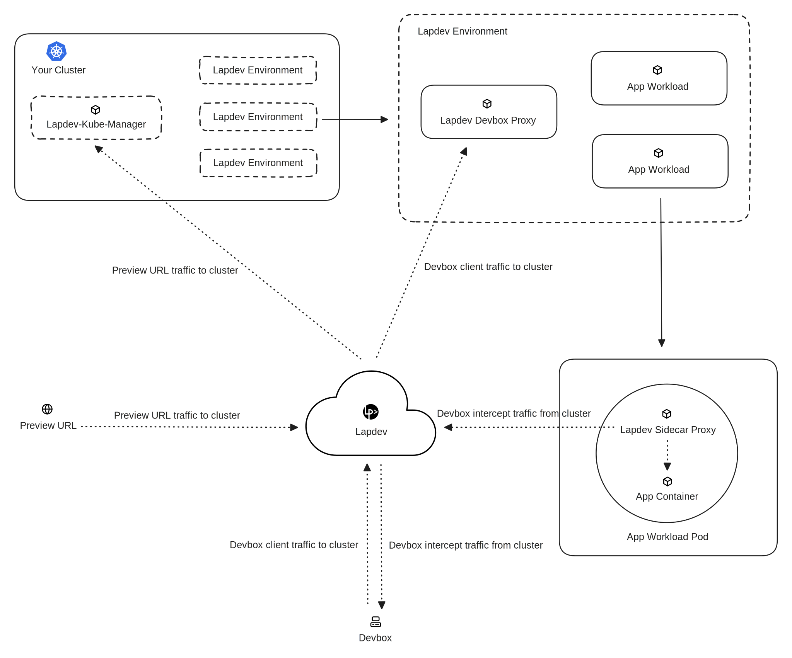

# Architecture

This document explains how Lapdev works and how its components interact to provide seamless Kubernetes development environments.

### Overview

Lapdev consists of three main components:

1. **Lapdev API Server** (SaaS) - Manages users, authentication, and orchestrates environment creation
2. **Lapdev-Kube-Manager** (In your cluster) - Reads production manifests and manages dev environments
3. **[Devbox](../devbox.md) CLI** (Developer's machine) - Enables local debugging with cluster connectivity

### Architecture Diagram

### Component Details

#### Lapdev API Server (SaaS)

The Lapdev cloud service handles:

* **User authentication and authorization** - GitHub/GitLab OAuth, team management
* **Environment orchestration** - Receives environment creation requests from users
* **Secure tunnel management** - Establishes websocket tunnels between your cluster and Lapdev
* **[Preview URL](../preview-url.md) routing** - Routes traffic from automatically generated HTTPS URLs to your cluster

**Security:**

* Communicates with your cluster via secure websocket tunnels (TLS encrypted)
* No direct access to your cluster's API server
* Receives workload manifests (Deployments, StatefulSets, ConfigMaps, Secrets) from lapdev-kube-manager to build App Catalogs
* You control which workloads Lapdev can access through App Catalog selection
* No access to runtime application data (databases, logs, persistent volumes)

#### Lapdev-Kube-Manager (In Your Cluster)

Deployed as a single Kubernetes deployment in your cluster, `lapdev-kube-manager`:

* **Reads production manifests** - Discovers Deployments, StatefulSets, ConfigMaps, Secrets, and Services from your production namespace to build [App Catalogs](../app-catalog.md)
* **Creates dev [environments](../environment.md)** - Replicates selected workloads into isolated or shared namespaces
* **Manages sync** - Monitors production manifests for changes and updates dev environments
* **Handles traffic routing** - For [branch environments](branch-environment-architecture.md), routes traffic to the correct version of services (see [Traffic Routing Architecture](traffic-routing-architecture.md))
* **Establishes secure tunnel** - Maintains websocket connection to Lapdev API Server for orchestration

**Permissions:**

* Read access to production namespace (to read manifests)
* Full access to Lapdev-managed namespaces (to create/update environments)
* No access to other cluster resources

#### Devbox CLI (Developer Machine)

The `lapdev devbox` command-line tool enables local development:

* **Traffic interception** - Routes requests for specific services to `localhost` (controlled via Lapdev dashboard)
* **Cluster connectivity** - Provides transparent access to in-cluster services (databases, APIs, caches)
* **Secure tunnel** - Establishes encrypted connection to Lapdev API Server, which proxies to your cluster

**How it works:**

1. Developer runs `lapdev devbox connect` and sets their active environment in the dashboard
2. Devbox establishes secure tunnel: `Developer → Lapdev API → lapdev-kube-manager`
3. Developer enables traffic interception for specific services in the Lapdev dashboard
4. Traffic for intercepted services is routed to developer's localhost
5. Developer's code can transparently access in-cluster services (e.g., `http://payment-service:8080`)

Learn more: [Devbox Concept](../devbox.md) | [Local Development with Devbox](../../how-to-guides/local-development-with-devbox.md)

### Learn More

**Specialized Architecture Documentation:**
* [Traffic Routing Architecture](traffic-routing-architecture.md) - How Lapdev routes traffic between components
* [Branch Environment Architecture](branch-environment-architecture.md) - Cost-effective environment model details

**Core Concepts:**
* [Cluster](../cluster.md) - How clusters connect to Lapdev
* [App Catalog](../app-catalog.md) - Blueprint for your application
* [Environment](../environment.md) - Running instances of your app
* [Preview URL](../preview-url.md) - HTTPS access to your services

**Getting Started:**
* [Connect Your Kubernetes Cluster](../../how-to-guides/connect-your-kubernetes-cluster.md)
* [Create an App Catalog](../../how-to-guides/create-an-app-catalog.md)
* [Create Lapdev Environment](../../how-to-guides/create-lapdev-environment.md)
